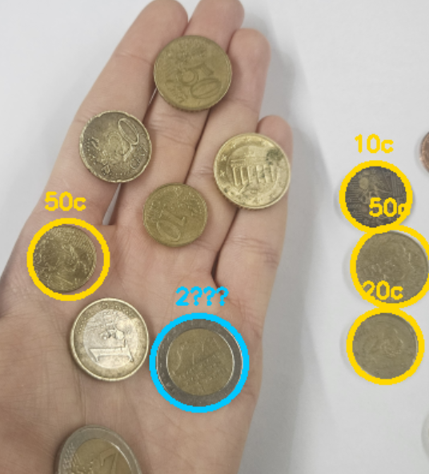
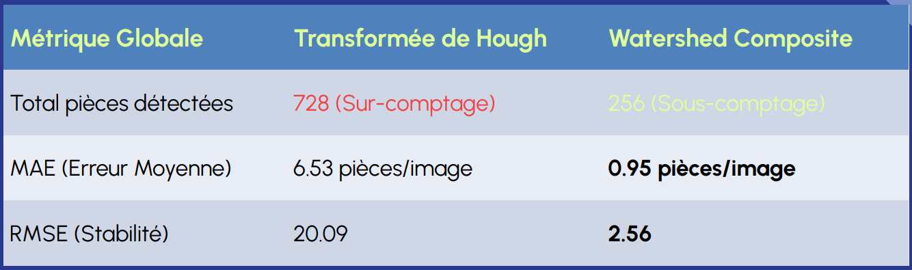
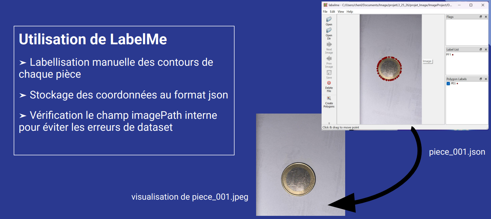
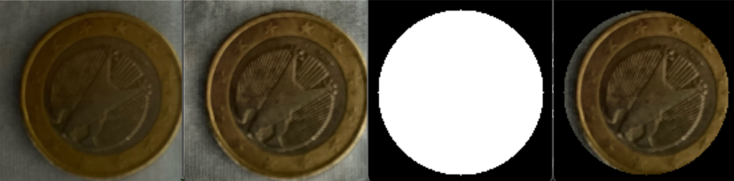
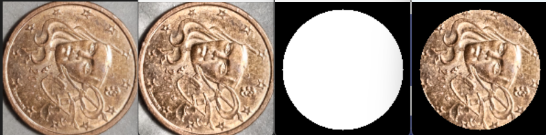
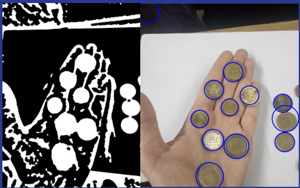
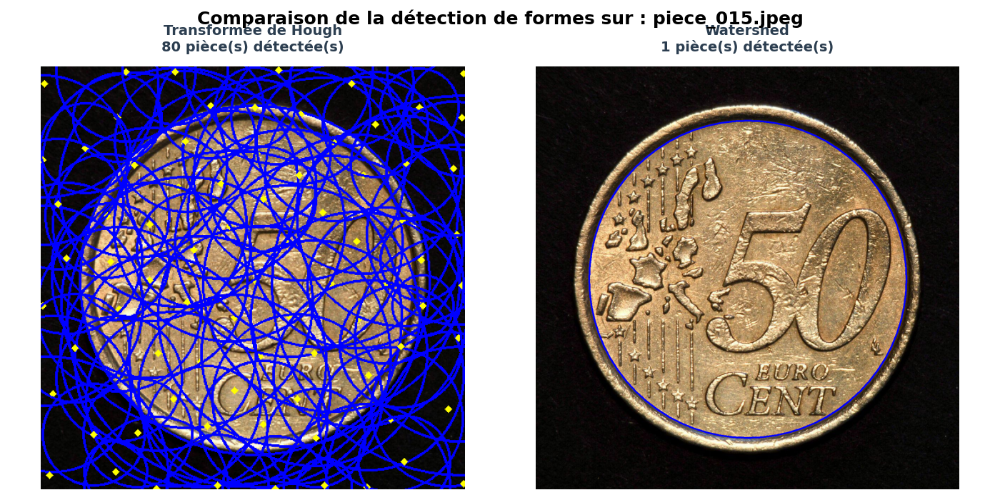
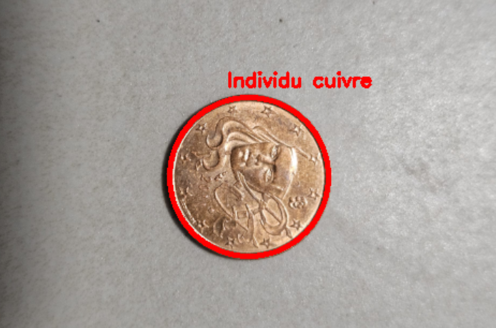

# 🪙 Détection et Classification Automatique de Pièces de Monnaie


Ce projet de vision par ordinateur a pour but de localiser et segmenter des pièces de monnaie à partir d'images complexes, avant d'en déduire leur valeur. L'objectif initial et le défi principal résident dans la **détection géométrique** parfaite des pièces.



---

## 📊 1. Bilan Quantitatif des Détections

L'objectif premier du projet étant la détection précise, voici d'emblée les résultats de notre évaluation menée sur un jeu de **96 images** (comportant **347 pièces** attendues au total). Nous avons comparé deux algorithmes majeurs : la Transformée de Hough et l'algorithme Watershed.



L'erreur quadratique (RMSE) de **Watershed** se révèle être **près de 8 fois plus faible** que celle de Hough. Il limite considérablement le sur-comptage et s'impose comme l'algorithme le plus fiable pour la suite du traitement.

---

## ⚙️ 2. Détection de Pièces : De la donnée aux algorithmes

### A. Constitution du Dataset & Vérité-Terrain
Pour pouvoir calculer les métriques présentées ci-dessus, une méthodologie rigoureuse a été appliquée :
* **Labellisation :** Utilisation de l'outil graphique **LabelMe** pour détourer manuellement chaque pièce.
* **Format :** Exportation des coordonnées des polygones au format JSON.
* **Structure :** Séparation étanche du dataset en une base de tests et une base de validation.



### B. Pipeline de Prétraitement
Pour s'affranchir des variations d'éclairage et des ombres portées, l'image subit un pipeline de préparation avant la détection :
1. Extraction du **canal L** de l'espace colorimétrique **HLS**.
2. Égalisation adaptative (**CLAHE**) pour accentuer les contrastes locaux.
3. Création d'un masque binaire délimitant la zone d'intérêt.

**Exemple sur une pièce de 1€ :**


**Exemple sur une pièce en cuivre :**


### C. Comparaison des Algorithmes (Hough vs Watershed)
Détecter des pièces sur des fonds complexes (comme la peau humaine) génère énormément de bruit lors de la binarisation :



Face à ce défi, nos deux approches ont réagi très différemment :
* **Transformée de Hough Circulaire :** Très rapide mais ultra-sensible au bruit de texture. L'accumulateur de gradients s'affole sur les fonds complexes, créant de sévères artefacts de multi-détection.
* **Algorithme Watershed (Ligne de partage des eaux) :** Approche par croissance de régions initiée par une transformation des distances. Extrêmement robuste, il réussit à isoler proprement une pièce unique même lorsque les contours sont flous.



---

## 🎨 3. Détection de la Valeur (Classification)

Une fois la phase critique de détection validée (via Watershed) et les pièces isolées sur fond noir, le projet procède à une classification de leur valeur en s'appuyant sur l'espace colorimétrique **HSV** :
* **Pièces bicolores (1€, 2€) :** Génération de deux masques imbriqués (coeur central vs anneau externe). L'analyse de la **saturation (S)** différencie le métal doré (forte saturation) du métal argenté (faible saturation).
* **Pièces unies (Cuivre vs Or) :** L'analyse de la **teinte (H)** permet de discriminer finement les nuances de rouge/brun du cuivre des nuances jaunes des alliages d'or nordique.



---

## 🚀 4. Installation & Exécution

### Configuration de l'environnement (Windows)
1. Créez un environnement virtuel Python :
   ```cmd
   python -m venv venv

```

2. Activez l'environnement :
```cmd
venv\Scripts\activate

```


3. Installez les dépendances requises :
```cmd
pip install -r requirements.txt

```


### Lancement des modules

Exécutez les scripts depuis la racine du projet :

* **Lancement de la détection de forme (Hough et Watershed) :**
```cmd
python -m src.main

```


* **Test de la classification de valeur :**
```cmd
python -m src.detection_valeur.Detection_valeur

```


* **Calcul des métriques d'évaluation :**
```cmd
python -m src.calcul_metrique.metrique

```


---

*Développé par Louis Chen, Michel Lin et Rayane Kachbi - Projet UE Image 2025/2026.*

```
